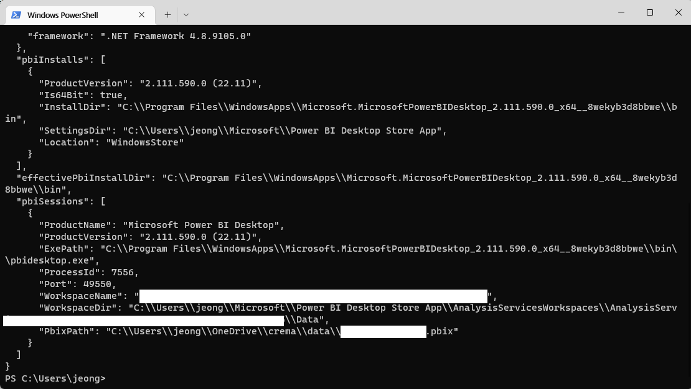

# PBI-TOOLS

## pbi-tools 소개

현재 고겍사 데이터 셋은 하나로 이루어져 있고 각 대시보드 마다 mallid 필터를 적용하여 구분 중
모든 대시보드 수정을 한번에 처리하기 위해 pbi-tools를 활용
pbi-tools는 power bi 데스크탑 파일에서 리포트와 데이터셋 분리, 리포트 내용 변경 및 게시가 가능하도록 함
azure devOps나 github 등 활용하여 ci/cd를 할 수 있다.

구동: 터미널에서 명령어 입력

## **pbi-tools 설치**

공식페이지에서 환경에 맞는 파일 선택하여 설치>Tutorial 참고

[https://pbi.tools/](https://pbi.tools/)

## **기본 명령어(공식홈페이지나 터미널에서 pbi-tools 입력 시 코드 확인 가능)**

1. 현재 실행 중인 pbix 정보(pid 확인) 및 power bi desktop 정보 확인
~~~
pbi-tools info
~~~

2. pbix파일에서 데이터와 리포트를 추출
~~~
pbi-tools extract
~~~

실 입력 예시 (마지막 -watch 입력 시 변경 탐지) 
~~~
pbi-tools extract ./file_name.pbix
pbi-tools extract -pid 000000
~~~

pbix 디렉토리와 동일한 경로에 폴더 생성

 pbiproj가 있는 폴더 지정 후 저장할 경로 함께 지정

~~~
pbi-tools compile ./"+file_name+" ./"+file_name
~~~
json 파일 변경 후 pbix로 변경하여 저장

  

  .pbixproj.json가 있는 폴더 경로 지정, pbixproj파일에 deployments 다음에 문구 입력(”Model”)

~~~
pbi-tools deploy . Model
~~~

# **실 사용 예시/ 파이썬 운영코드**

## **미리 체크할 것**

(Workspace ID와 name) 권한-

 id는 주소창 빨강색 부분으로 확인

dataset에 권한 설정해야 함

(mallid와 name) mallid를 포함한 json파일에서 mallid가 string인지 integer인지 확인 후 json수정> string이 좀 더 안정적

**pbixproj json파일 수정 내용(deploy 시 필요한 정보 입력)**  
config.json 참고  
수정할 부분의 value 수정  
현 작업에서는 mallid value를 수정  

    

**config json 등 mallid 슬라이서 json 파일 경로 확인(Report에서 내용 수정 ex. mallid 등)**  

  

## **파이썬 코드**

실제 라이브 중인 pbix 파일을 다운로드 후 pbi-tools 상에서 구동할 경로에 저장(pbi-toos는 환경 변수 path 추가를 한다면 다른 경로에 있어도 무관)
생성할 몰정보 불러오기(mallid와 name)

live할 workspace 정보 체크 및 권한 생성(Workspace ID와 name)

pbix extract(추출) 실행 추출 후 (Report폴더와 .pbixproj.json파일 생성)

Report폴더에서 수정할 json 파일 및 경로 체크

수정할 json파일에서 mallid 변경

pbix compile(json파일 합치기) 실행

.pbixproj.json파일 정보 변경(deploy를 위한 작업)

pbix deploy(게시) 실행

    

## 목표

pbix 파일에서 mallid 수정 후 power bi workspace에 배포 작업 자동화

예상되는 효율 증가: 간단한 작업으로 실행/다른 작업과 동시에 진행 가능/power bi desktop를 켜지 않고 작업 가능하여 컴퓨터 리소스 감소

아직 부족한 것: 처음 별도의 배포 작업 필요, 완전한 신규 대시보드의 경우 json 파일에서 변경할 부분이 어디인지 체크가 필요함

추가 작업: github과 연동하여 변동 사항 체크 및 커밋

## **별첨** azure devOps를 통한 deploy, yml 파일 활용

pbixproj json파일과 mallid정보가 있는 json 파일 정보 수정

pbixproj 가 있는 폴더를 git add, 폴더에 yml 파일도 넣어둬야 함(azure devops에서 yml파일 생성 가능)

azure devops에서 project 생성 후 new pipelines를 하면 아래의 화면이 나옴

GitHub yaml 선택

생성한 git repository 선택

install선택

아래와 같이 선택

생성한 yml파일 선택 후 run

 

workspace에서 정상 업로드 확인

- yml 코드

정상 사용을 위해서 mallid json 파일/pbixproj.json 수정 자동화 방법을 모색해야 함